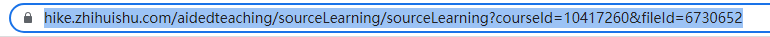
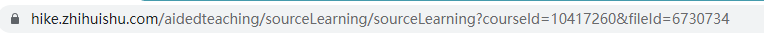
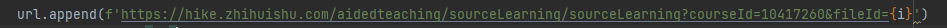

### `说明：本程序使用selenium自动化浏览器操作，以此实现看自动看智慧树网课的需要，因此无需担心被检测`
### `使用所需：python, lxml, selenium, chromedriver, chrome浏览器`
`使用说明：` `首先需要安装Chrome或Firefox浏览器，推荐chrome 
然后安装python及lxml,selenium库, 在浏览器信息中查看你的Chrome版本,下载对应的Chromedriver版本，然后将下载的文件与此程序放至同一目录下即可`
_http://chromedriver.storage.googleapis.com/index.html_
###`修改代码中username, password 为你的手机号与密码`
## **`最重要的一步，输入你需要自动播放的课程的url`**
### 举个例子：这是课程视频第一节的url

### 这是最后一节课的url

### 观察可以发现仅改变了filed后的数字，因此只需将代码中此处的数字改为{i},并将start_num改为视频开始的数字，将end_num改为视频结束的数字即可，其余不变即可

这里添加了一个不打开浏览器的选择，只要将此行代码注释去掉便可以不打开浏览器了。
实现这样一个东西其实挺简单的，这里仅仅是提供了selenium的一个小应用，其实只要简单了解一下这个包，便能很熟练的使用一些基本功能了。
若遇到错误，请检查网络条件，或直接修改代码。
